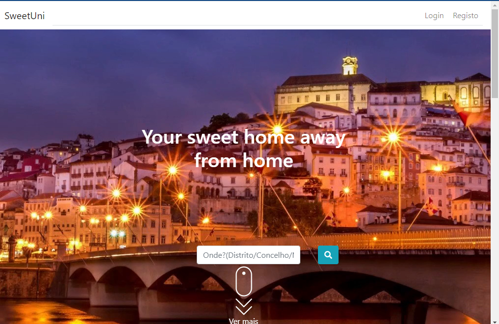

# SweetUni( vugo  pti-ptr-lumen)
A platform that helps out-of-town Universidade students find accommodation. The platform also facilitates communication between students and the landlord by including features such as a chat function and the ability for students to request issue resolution. Additionally, it provides tools for landlords to track issues and manage rent payments.

## Technologies
- Laravel/Lumen: These frameworks were utilized to develop the platform's microservices, providing a robust and scalable back-end infrastructure.
- ReactJS and Bootstrap: Employed for developing the platform's front-end, enabling a user-friendly and responsive interface for students and landlords to interact with.
- JWT (JSON Web Tokens): Used for authentication across the microservices, ensuring secure access to the platform's features and data for authorized users.
- MySQL was a database management system to store information related to accommodations, users, and chats.

## Project Structure:
- ApiAccommodation: This directory comprises the accommodation microservice, which manages accommodation-related functionalities.
- ApiCommunication:  Encompasses the chat microservice, facilitating communication between students and landlords.
- ApiGateway: Gateway microservices, overseeing access to other microservices and managing user authentication and authorization.
- ClientLumen: Contains the initial implementation of the front-end.
- Client: This component contains the front-end implementation developed using ReactJS and Bootstrap.
